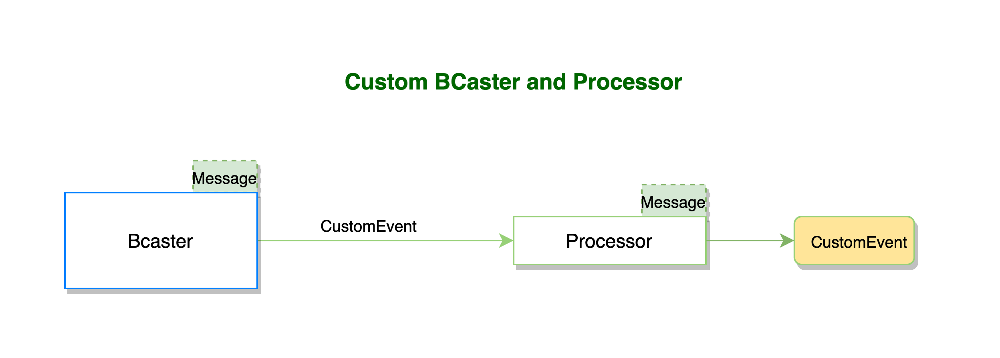

<a href="https://github.com/dcedyga/gooldi"></a> was born with the aim to use golang concurrency capabilities to provide a set of streaming patterns and approaches that allow to build very complex flows/ pipelines to fulfil the main paradigms for deterministic and no-deterministic stream processing. The following structs conform gooldi's core: Message, MessagePair, Bcaster, Processor, Filter, MessageMultiplexer and MultiMessageMultiplexer. 

<a href="https://github.com/dcedyga/gooldi"></a> brings an implementation of most of the concurrency patterns define in ["Concurrency in Go"](https://katherine.cox-buday.com/concurrency-in-go/) by Cox-Buday. And a set of generators and utilities to ease working with these concurrency patterns.

<a href="https://github.com/dcedyga/gooldi"></a> provides a thread-safe implementation of Map, Slice, SortedMap and SortedSlice to access to the relevant maps and slice types shared across goroutines without race conditions.

<a href="https://github.com/dcedyga/gooldi"></a> can deliver, performance wise, throughputs of 500k processed messages per second (hardware used: macbook pro with 32G of RAM and 2,9 GHz Intel Core i9 processor).
## Concurrency in Go
```
Concurrency is about dealing with lots of things at once. It is a way to structure software, 
particularly as a way to write clean code that interacts well with the real world.

— Rob Pike
```
Concurrency refers to the design of the system, while parallelism relates to the execution. Concurrent programming is one of the most interesting aspects of the Go language. Go is designed with concurrency in mind and allows us to build complex concurrent pipelines. Go concurrency main building blocks are around parallel composition of sequential processes and communication between these processes. Go’s approach to concurrency can be best phrased by:
```
Do not communicate by sharing memory; instead, share memory by communicating. 
```
### Go Concurrency vs Multithreading

In any other mainstream programming language, when concurrent threads need to share data in order to communicate, a lock is applied to the piece of memory. Instead of applying a lock on the shared variable, Go allows you to communicate (or send) the value stored in that variable from one thread to another. The default behavior is that both the thread sending the data and the one receiving the data will wait till the value reaches its destination. The “waiting” of the threads forces proper synchronization between threads when data is being exchanged.

Some facts:
 - [x] goroutines are managed by go runtime and has no hardware dependencies while OS threads are managed by kernal and has hardware dependencies
- [x] goroutines are smaller: typically 2KB of stack size, threads 1-2MB
- [x] Stack size of go is managed in run-time and can grow up to 1GB which is possible by allocating and freeing heap storage while for threads, stack size needs to be determined at compile time
- [x] goroutine use channels to communicate with other goroutines with low latency. There is no easy communication medium between threads and huge latency between inter-thread communication
- [x] goroutine do not have any identity while threads do (TID)
- [x] goroutines are created and destoryed by the go's runtime. These operations are very cheap compared to threads as go runtime already maintain pool of threads for goroutines. In this case OS is not aware of goroutines
- [x] goroutines are coopertively scheduled,  when a goroutine switch occurs, only 3 registers need to be saved or restored. Threads are preemptively scheduled, switching cost between threads is high as scheduler needs to save/restore more than 50 registers and states. This can be quite significant when there is rapid switching between threads.

## gooldi: Concurrency patterns
Important concurrency patterns to highlight are:

- <a href="./concurrency/bridge.go#L01"></a> is a way to present a single-channel facade over a channel of channels. It is used to consume values from a sequence of channels (channel of channels) doing an ordered write from different sources. By bridging the channels it destructures the channel of channels into a simple channel, allowing to multiplex the input and simplify the consumption.With this pattern we can use the channel of channels from within a single range statement and focus on our loop’s logic.
- <a href="./concurrency/fan-in.go#L01"></a> combines multiple results in the form of an slice of channels into one channel. This implementation uses a WaitGroup in order to multiplex all the results of the slice of channels. The output is not produced in sequence. This pattern is good for  Non-deterministic stream processing when order is not important and deterministic outcomes are not required.
- <a href="./concurrency/fan-in.go#L40"></a> combines multiple results in the form of an slice of channels into one channel. This implementation uses a a recursive approach in order to multiplex all the results of the slice of channels. The output is not produced in sequence. This pattern is good for  Non-deterministic stream processing when order is not important and deterministic outcomes are not required.
- <a href="./concurrency/or-done.go#L01"></a>  Wraps a channel with a select statement that also selects from a done channel. Allows to cancel the channel avoiding go-routine leaks.
- <a href="./concurrency/or.go#L01"></a> returns the value of the fastest channel.
- <a href="./concurrency/route.go#L01"></a> Representation of the tee pattern. Takes a single input channel and an arbitrary number of output channels and duplicates each input into every output. When the input channel is closed, all outputs channels are closed. It allows to route or split an input into multiple outputs.

### Utilities and Generators

- <a href="./concurrency/as-chan.go#L01">AsChan</a>  sends the contents of a slice through a channel
- <a href="./concurrency/close-chan.go#L01">CloseChannel</a> Checks if the channel is not closed and closes it
- <a href="./concurrency/take.go#L01">Take</a> Takes a defined number of values by num from a channel
- <a href="./concurrency/to-string.go#L01">ToString</a>  Converts any type of channel into a string channel
- <a href="./concurrency/repeat.go#L01">Repeat</a> Generator that repeats the values defined on the values slice indefinitely.

## gooldi: Thread-safe Maps and Slices
```
Slice and Map - cannot be used safely from multiple goroutines without the risk of having 
a race condition.
```
<a href="https://github.com/dcedyga/gooldi"></a> provides and implementation of Slice and Map types which can be safely shared between multiple goroutines by protecting the access to the shared data by a mutex. 

What a mutex does is basically to acquire a lock when it needs to access our concurrent type, When holding the lock a goroutine can read and/or write to the shared data protected by the mutex safely, this lock can be acquired by a single goroutine at a time, and if other goroutine needs access to the same shared data it waits until the lock has been released by the goroutine holding the lock. <a href="https://github.com/dcedyga/gooldi"></a> implementation of these types manages the acquisition and release of locks avoiding deadlocks and unwanted behaviours.

<a href="./concurrency/slice.go#L01"></a> and <a href="./concurrency/sorted-slice.go#L01"></a> are `slice` types and 
<a href="./concurrency/map.go#L01"></a> and <a href="./concurrency/sorted-map.go#L01"></a> are `map` types within <a href="https://github.com/dcedyga/gooldi"></a> that are safe to share among threads. 
`SortedSlice` is an ordered implementation of the `Slice` type and `SortedMap` is an ordered implementation of the `Map` type. The performance among sorted vs non-sorted implementations of these types are very similar as `SortedSlice` and `SortedMap` have a `dirty` property that is set when there is a change on the `SortedSlice` or the `SortedMap`. The sort mechanism will only happen when attempting to read the relevant type and if the `dirty`property is set to `true`, keeping the `SortedSlice` and the `SortedMap` very performant. 

```go
//Sample SortedSlice
s := NewSortedSlice()
cancel := make(chan interface{})
s.Append("Juan")
s.Append("Pepi")
s.Append("David")
s.Append("Ayleen")
s.Append("Lila")
s.Append("Freddy")
s.Append("Moncho")
s.Append("Zac")
s.Append("Caty")
s.Append("Tom")
for item := range s.IterWithCancel(cancel) {
    fmt.Printf("%v:%v\n", item.Index, item.Value)
    if item.Index == 5 {
        close(cancel)
        break
    }
}
```
  
```go
//Sample SortedMap
m := NewSortedMap()
cancel := make(chan interface{})
for i := 0; i < 10; i++ {
    m.Set(i, i)
}
for item := range m.IterWithCancel(cancel) {
    fmt.Printf("%v:%v\n", item.Key, item.Value)
}
```
## gooldi: Handling channel cancellation

<a href="https://github.com/dcedyga/gooldi"></a> provides an ordered layered mechanism in order to handle cancellation of channels. While we explored the use of the go `context`package to use cancelable contexts, the way it deals with the cancellation is not fit for purpose for the processing mechanisms that are part of the <a href="https://github.com/dcedyga/gooldi"></a> library. Cancellation within the `context` package happens in a non-deterministic way and it can lead to exceptions due to the closure of channels that are still active.

<a href="./concurrency/done-manager.go#L01"></a> and <a href="./concurrency/done-handler.go#L01"></a> are the two types that manage channel cancellation in <a href="https://github.com/dcedyga/gooldi"></a>. `DoneManager` registers `DoneHandlers` and keeps track of them. It has the capability to organize the `DoneHandlers`in a layered `Map` and when cancelling the `DoneManager`loops through this map by layers. It has also the capability to add a delay between layer cancellation, allowing for a graceful shutdown.
In `DoneManager` a deadline and a timeout can be set, so cancellation can be triggered when these are reached.
In `DoneHandler` we can setup a deadline that will cancel that specific handler and notify the `DoneManager` for proper de-registration of the `DoneHandler`.

```go
//DoneManager and DoneHandler Sample
dm := NewDoneManager(
    DoneManagerWithDelay(1*time.Millisecond),
    DoneManagerWithTimeout(100*time.Millisecond),
)
dh := dm.AddNewDoneHandler(0)
dh1 := dm.AddNewDoneHandler(1)
go func() {
    for {
        select {
        case <-dh.Done():
            fmt.Printf(
                "We are done with delay and timeout - on layer 0 -> %v: %v\n",
                dh.ID(),
                dh.Err(),
            )
            return
        }
    }
}()
go func() {
    for {
        select {
        case <-dh1.Done():
            fmt.Printf(
                "We are done with delay and timeout - on layer 1 -> %v: %v\n",
                dh1.ID(),
                dh1.Err(),
            )
            return
        }
    }
}()
go func() {
    for {
        select {
        case <-dm.Done():
            fmt.Printf(
                "We are done with delay and timeout - on DoneManager -> %v: %v\n",
                dm.ID(),
                dm.Err(),
            )
            return
        }
    }
}()

time.Sleep(1000 * time.Millisecond)

```

## gooldi: Stream Processing Entities

The foundation of <a href="https://github.com/dcedyga/gooldi"></a> stream processing is based on the following concepts. We have:
- <a href="./concurrency/message.go#L15"></a> and <a href="./concurrency/message.go#L43"></a> entities that are shared across the pipeline and acts as the interchangeable entity within the flow of the process. These entities are the representation of the Stream as a Stream of Messages or MessagePairs. 
- <a href="./concurrency/bcaster.go#L13"></a> is a broadcaster that allows to broadcast any type of message to its listeners. You can register a listener with the `AddListener`method that returns a channel of type interface{}. <a href="./concurrency/bcaster.go#L13"></a> uses a transformation function, that is highly customizable (you can use your own), to map the input message to an output structure. the default transform function called `defaultBCasterTransformFn` Gets the bcaster, input and outputs the input with no changes. A register listener can be removed from the collection of listeners by using the `RemoveListener` method.
- <a href="./concurrency/processor.go#L12"></a>
- <a href="./concurrency/filter.go#L12"></a>
- <a href="./concurrency/msg-multiplexer.go#L13"></a>
- <a href="./concurrency/multi-msg-multiplexer.go#L14"></a>
#### *1. Message and MessagePair*

```go
/*
Message 
*/
type Message struct {
	ID         string
	Message    interface{}
	TimeInNano int64
	MsgType    string
	CorrelationKey int64
	Index int64
}

/*
MessagePair
*/
type MessagePair struct {
	In             *Message
	Out            *Message
	Index          int64
	CorrelationKey int64
}

```
<a href="./concurrency/message.go#L15"></a>  is a Struct that represents an message in the context of the concurrency package. With the following properties:
 - **ID**: the ID of the message
 - **Message**: the Message,
 - **TimeInNano**: the time that was produced
 - **MsgType**: the type of the message,
 - **CorrelationKey**: a correlation key to correlate to other messages
 - **Index**: the index related to the order that can be used to produce deterministic outputs

<a href="./concurrency/message.go#L43"></a> is a Struct that represents an input/output message Pair in the context of the concurrency package. With the following properties:
- **In**: represents an Input Message,
- **Out**: represents an Output Message,
- **Index**: a index number that is usefull to define the processing order of the MessagePair 
- **CorrelationKey**: a correlationKey to correlate to other messages

`NewMessage`and `NewMessagePair`are constructors that simplify the creation of these entities.
```go
/*
Message constructor
*/
NewMessage(fmt.Sprintf("This is message 1"),
    "string",
    MessageWithCorrelationKey(1),
    MessageWithIndex(1),
)
```
#### *2. BCaster*

<a href="./concurrency/bcaster.go#L13"></a> Is a broadcaster that allows to send messages of different types to registered listeners using go concurrency patterns. Listeners are chan interfaces{} allowing for go concurrent communication. Closure of BCaster is handle by a DoneHandler that allows to control they way a set of go routines are closed in order to prevent deadlocks and unwanted behaviour It detects when listeners are done and performs the required cleanup to ensure that messages are sent to the active listeners.

```go
/*
BCaster
*/
type BCaster struct {
	id           string
	listeners    *SortedMap
	closed       bool
	listenerLock *sync.RWMutex
	MsgType      string
	doneHandler  *DoneHandler
	lock         *sync.RWMutex
	transformFn  func(b *BCaster, input interface{}) interface{}
}
```
It has the following methods:

* **NewBCaster** - Constructor which gets a doneHandler and a msgType and retrieves a BCaster pointer. It also allows to inject BCasterTransformFn as an option
* **ID** - retrieves the Id of the Bcaster
* **BCasterTransformFn** - option to add a function to transform the output into the desired output structure of the BCaster
* **AddListener** - creates a listener as chan interface{} with a DoneHandler in order to manage its closure and pass it to the requestor so it can be used to consume messages from the Bcaster
* **RemoveListenerByKey** - Removes a listener by its key value
* **RemoveListener** - removes a listener
* **Broadcast** - Broadcast a message to all the active registered listeners. It uses a transform function to map the input message to a desired output. The default transform function just returns the input message to be broadcasted to all the active registered listeners.
* **defaultBCasterTransformFn** - Private method and default transform function of the `BCaster`that gets the bcaster input and outputs the input without any variation.

```go
//BCaster sample
dm := NewDoneManager(DoneManagerWithDelay(50 * time.Millisecond))
dh := dm.AddNewDoneHandler(0)
//Create caster
b := NewBCaster(dh,
    "string",
)
//...
go func() {
    for msgId := 0; msgId < 30; msgId++ {
        e := NewMessage(
            msgId,
            b.MsgType,
        )
        b.Broadcast(e)

    }

}()
```

More code samples in:
<a href="./concurrency_test/base_test.go">Base Test</a> and <a href="./concurrency_test/bcaster_test.go">BCaster Test</a>
#### *3. Processor*
<a href="./concurrency/processor.go#L12"></a> Unit that listen to an input channel (inputChan) and process work. Closing the inputChan channel needs to be managed outside the Processor using a DoneHandler It has a DoneHandler to manage the lifecycle of the processor, an index to determine the order in which the processor output results might be stored in a multiplexed pattern, an id of the processor, the name of the processor, the state of the processor and an output channel that emits the processed results for consumption.

```go
/*
Processor
*/
type Processor struct {
	Name          string
	doneHandler   *DoneHandler
	inputChan     chan interface{}
	index         int64
	id            string
	outputChannel chan interface{}
	lock          *sync.RWMutex
	state         State
	transformFn   func(p *Processor, input interface{}, result interface{}) interface{}
}
```
* **NewProcessor** - Constructor
* **ProcessorTransformFn** - option to add a function to transform the output into the desired output structure to the Processor
* **ProcessorWithIndex** - option to add a index value to the processor to define its order of execution
* **ProcessorWithInputChannel** - option to add an inputchannel to the processor
* **ID** - retrieves the Id of the Processor
* **Index** - retrieves the Index of the Processor
* **InputChannel** - retrieves the InputChannel of the Processor
* **OutputChannel** - retrieves the OutputChannel of the Processor
* **Process** - When the processor is in Processing state processes a defined function. When the Processor is in stop state the processor will still consume messages from the input channel but it will produce a nil output as no process will be involved.
* **Stop** - stops the processor.
* **Start** - starts the processor.
* **GetState** - retrieves the state of the Processor
* **HasValidInputChan** - checks if the input channel is valid and not nil.
* **ProcessorMessagePairTransformFn** - Gets the processor, input Message and output message and returns the processed output in the form of an MessagePair
* **defaultProcessorTransformFn** - Gets the processor, input and result and outputs the result
```go
//Processor sample

//The process function
func process(pr *Processor, input interface{}, params ...interface{}) interface{} {
	msg := input.(*Message)
	id := params[0]
	i := msg.Message.(int) * 2
	return NewMessage(fmt.Sprintf("ClientId %v: multiplies by 2 -> message: %v, value: %v", id, msg.Message, i),
		msg.MsgType,
		MessageWithCorrelationKey(msg.CorrelationKey),
		MessageWithIndex(pr.Index()),
	)
}

//The Processor
w := NewProcessor(
    fmt.Sprintf("worker%v", 1),
    dh1,
    ProcessorWithIndex(int64(1)),
    ProcessorWithInputChannel(b.AddListener(dh1)),
)

go w.Process(process, 1)

// Print output
go func() {
    i := 0
    for pe := range w.OutputChannel() {
        pr := pe.Value.(*Message)
        fmt.Printf("CorrelationKey(%v) - Index(%v) - TimeInNano(%v) - ID(%v) - MsgType(%v) - Message: %v \n", pr.CorrelationKey, pr.Index, pr.TimeInNano, pr.ID, pr.MsgType, pr.Message)
    }
}()
```

More code samples in:
<a href="./concurrency_test/base_test.go">Base Test</a> and <a href="./concurrency_test/msg_multiplexer_patterns_test.go">Msg Multiplexer Patterns Test</a>

#### *4. Filter*
<a href="./concurrency/filter.go#L12"></a> Unit that listen to an input channel (inputChan) and filter work. Closing the inputChan channel needs to be managed outside the Filter using a DoneHandler. It has a DoneHandler to manage the lifecycle of the filter, an index to determine the order in which the filter might be run, an id of the filter, the name of the filter, the state of the filter and an output channel that emits the processed results for consumption.

```go
/*
Filter
*/
type Filter struct {
	Name          string
	doneHandler   *DoneHandler
	inputChan     chan interface{}
	index      	  int64
	id            string
	outputChannel chan interface{}
	lock          *sync.RWMutex
	transformFn   func(f *Filter, input interface{}) interface{}
	state         State
}
```
* **NewFilter** - Constructor
* **FilterWithIndex** - option to add a index value to the filter to define its order of execution
* **FilterWithInputChannel** - option to add an inputchannel to the filter
* **FilterTransformFn** - option to add a function to transform the output into the desired output structure to the Filter
* **ID** - retrieves the Id of the Filter
* **Index** - retrieves the Index of the Filter
* **InputChannel** - retrieves the InputChannel of the Filter
* **OutputChannel** - retrieves the OutputChannel of the Filter
* **Filter** - When the filter is in Processing state filters a defined function. When the Filter is in stop state the filter will still consume messages from the input channel and it will output the input Message as no filter will be involved.
* **Stop** - stops the filter.
* **Start** - starts the filter.
* **GetState** - retrieves the state of the Filter
* **HasValidInputChan** - checks if the input channel is valid and not nil.
* **defaultFilterTransformFn** - Gets the filter and input outputs the input with the filter index, if the input has the Index property

```go
//Filter sample

//The filter function
func filterFn(f *Filter, input interface{}, params ...interface{}) bool {
	msg := input.(*MessagePair)
	i := msg.In.Message.(int) % 2
	return i == 0
}
// The Filter
filter := NewFilter(
    fmt.Sprintf("filter%v", 5),
    dh1,
    FilterWithIndex(5),
    FilterWithInputChannel(mp.Iter()),
)
go filter.Filter(filterFn)

// Print output
go func() {
    i := 0
    for v := range filter.OutputChannel() {
        _ = v
        item := v.(*MessagePair)
        s := item.Out.Message.(*SortedMap)
        fmt.Printf("-------\n")
        for pe := range s.Iter() {
            pr := pe.Value.(*MessagePair).Out
            fmt.Printf("CorrelationKey(%v) - Index(%v) - TimeInNano(%v) - ID(%v) - MsgType(%v) - Message: %v \n", pr.CorrelationKey, pr.Index, pr.TimeInNano, pr.ID, pr.MsgType, pr.Message)
        }
        i++
    }
    fmt.Printf("Total Messages Filtered: %v,\n", i)
}()

```

More code samples in:
<a href="./concurrency_test/base_test.go">Base Test</a> and <a href="./concurrency_test/msg_multiplexer_patterns_test.go">Msg Multiplexer Patterns Test</a>

#### *5. MsgMultiplexer*

<a href="./concurrency/msg-multiplexer.go#L13"></a> The default implementation MsgMultiplexer allows to create complex patterns where a Broadcaster can emit an message to multiple processors (consumers) that can potentially represent multiple processing systems, do the relevant calculation and multiplex the multiple outputs into a single channel for simplified consumption. Its main function is to Mulitplex a set of concurrent processors that process a common initial Message converging them into one channel,where the output is a Message which Message property is a sortedmap of the output values of the processors grouped by initial Message CorrelationKey and ordered by index value of each processor. Closure of MsgMultiplexer is handle by a DoneHandler that allows to control they way a set of go routines are closed in order to prevent deadlocks and unwanted behaviour. MsgMultiplexer outputs the multiplexed result in one channel using the channel bridge pattern. MsgMultiplexer default behaviour can be overridden by providing a MsgMultiplexerGetItemKeyFn to provide the comparison key of the items of a channel, with this function MsgMultiplexer has an algorithm to group the processed messages related to the same source into a SortedMap. A transformFn can be provided as well to map the output of the MsgMultiplexer to a specific structure. The defaultTransformFn transform the SortedMap of processor outputs into a Message which Message property is populated with this SortedMap

```go
/*
MsgMultiplexer
*/
type MsgMultiplexer struct {
	id                      string
	inputChannels           *Map
	doneHandler             *DoneHandler
	preStreamMap            *Map
	inputChannelsLastRegLen int
	stream                  chan (<-chan interface{})
	lock                    *sync.RWMutex
	index                   int64
	minIndexKey             interface{}
	MsgType                 string
	getItemKeyFn            func(v interface{}) int64
	transformFn             func(mp *MsgMultiplexer, sm *SortedMap, correlationKey int64) interface{}
}
```

* **NewMsgMultiplexer** - Constructor
* **MsgMultiplexerIndex** - option to add the index value to the MsgMultiplexer
* **MsgMultiplexerGetItemKeyFn** - option to add a function to resolve the key value of an item of the channel to the MsgMultiplexer
* **MsgMultiplexerTransformFn** - option to add a function to transform the SortedMap output into the desired output structure to the MsgMultiplexer
* **ID** - retrieves the Id of the MsgMultiplexer
* **Index** - retrieves the Index of the MsgMultiplexer
* **Set** - Registers a channel in the MsgMultiplexer, starts processing it and logs the length of the registered channels map.
* **Get** - Retrieves a channel reqistered in the MsgMultiplexer by key
* **Delete** - Deletes a registered channel from the MsgMultiplexer map of inputChannels and logs the length of the remaining registered channels map.
* **Iter** - iterates over the items in the Multiplexer. Each item is sent over a channel, so that we can iterate over the it using the builtin range keyword
* **PrintPreStreamMap** - prints the preStreamMap
* **defaultGetItemKeyFn** - Gets the key value used by the comparator in order to group the Messages in the SortedMap. Can be overridden for a more generic implementation that is not Message Oriented
* **MsgMultiplexerMessagePairGetItemKeyFn** - Gets the key value used by the comparator in order to group the Messages in the SortedMap. Can be overridden for a more generic implementation that is not Message Oriented
* **defaultTransformFn** - Transforms the SortedMap output into an Message for future consumption as part of the output channel of the MsgMultiplexer. Can be overridden for a more generic implementation
* **MsgMultiplexerMessagePairTransformFn** - Transforms the SortedMap output into an Message for future consumption as part of the output channel of the MsgMultiplexer. Can be overridden for a more generic implementation

```go
//MsgMultiplexer sample

dm := NewDoneManager(DoneManagerWithDelay(1 * time.Millisecond))
defer dm.GetDoneFunc()()
dh := dm.AddNewDoneHandler(0)
dh1 := dm.AddNewDoneHandler(1)
dh2 := dm.AddNewDoneHandler(2)
//Create caster
b := NewBCaster(dh,
    "string",
)
//Create Multiplexer
mp := NewMsgMultiplexer(dh2,
    b.MsgType, MsgMultiplexerIndex(1),
)
defer func() {
    dm.GetDoneFunc()()
    mp.PrintPreStreamMap()
}()
//Create Processors
w := createProcessors(mp, b, dh1, 4)

```

More code samples in:
<a href="./concurrency_test/base_test.go">Base Test</a> and <a href="./concurrency_test/msg_multiplexer_patterns_test.go">Msg Multiplexer Patterns Test</a>

#### *6. MultiMsgMultiplexer*

## gooldi: Deterministic and Non-Deterministic Stream Processing
## gooldi:Highly customizable

<a href="https://github.com/dcedyga/gooldi"></a> is highly customizable. For example one can define its own Message entity to represent better the Stream that it wants to process. With its own `BCaster`that has a specific transformation/mapping function of the Broadcast output.

**Process functions**
* The `Processor` process functions follow this primitive:
```go 
func func(pr *Processor, input interface{}, params ...interface{}) interface{} {}
```

**Mapping/Transformation functions**
* The `BCaster` transformation functions follow this primitive:
```go 
func func(b *BCaster, input interface{}) interface{}{
    //Code
}
```
* The `Processor` transformation functions follow this primitive:
```go
func func(p *Processor, input interface{}, result interface{}) interface{} {
    //Code
}
```

### BCaster and processor customization



As an example we could have a `CustomEvent` with an InitMessage and OutMessage properties, the BCaster has a custom transform function called `BCasterCustomEventTransformFn` which transforms an standard input `Message` into a `CustomEvent`that has the InitMessage and OutMessage properties filled with the input `Message`. The `BCaster` broadcasts the `CustomEvent`to all the registered listeners, in this case one `Processor`that uses it process function to square the Message property(payload) of the OutMessage of the incoming `CustomEvent` producing a new standard `Message` which is transformed by the `ProcessorCustomEventTransformFn` to produce a new `CustomEvent` with the InitMessage of the incomming `CustomEvent` as InitMessage property and the result `Message`of the process function as OutMessage property. This example just gives us an idea of how flexible <a href="https://github.com/dcedyga/gooldi"></a> is.

Please find below the entire code snippet:

```go
//BCaster and processor customization

//CustomEvent
type CustomEvent struct {
	InitMessage *Message
	OutMessage  *Message
}

//BCasterCustomEventTransformFn
func BCasterCustomEventTransformFn(b *BCaster, 
    input interface{}) interface{} {

	var msg *Message
	if input != nil {
		msg = input.(*Message)
	}
	e := &CustomEvent{
		InitMessage: msg,
		OutMessage:  msg,
	}
	return e
}

//customProcess3
func customProcess3(pr *Processor, 
    input interface{}, 
    params ...interface{}) interface{} {

	event := input.(*CustomEvent)
	//id := params[0]
	i := event.OutMessage.Message.(int) * event.OutMessage.Message.(int)
	return NewMessage(i,
		event.OutMessage.MsgType,
		MessageWithIndex(event.OutMessage.Index),
		MessageWithCorrelationKey(event.OutMessage.CorrelationKey),
	)
}
//ProcessorCustomEventTransformFn
func ProcessorCustomEventTransformFn(p *Processor, 
    input interface{}, 
    result interface{}) interface{} {

	var event *CustomEvent
	var resultMsg *Message
	if input != nil {
		event = input.(*CustomEvent)
	}
	if result != nil {
		resultMsg = result.(*Message)
	}
	r := &CustomEvent{
		InitMessage: event.InitMessage,
		OutMessage:  resultMsg,
	}
	return r
}
//main
func main(){
    dm := NewDoneManager(DoneManagerWithDelay(1 * time.Millisecond))
	defer dm.GetDoneFunc()()
	dh := dm.AddNewDoneHandler(0)
	dh1 := dm.AddNewDoneHandler(1)
	//Create caster
	b := NewBCaster(dh,
		"bcaster",
		BCasterTransformFn(BCasterCustomEventTransformFn),
	)
	//Create Processors
	w2 := NewProcessor(
		fmt.Sprintf("worker%v", 2),
		dh1,
		ProcessorWithIndex(2),
		ProcessorWithInputChannel(b.AddListener(dh1)),
		ProcessorTransformFn(ProcessorCustomEventTransformFn),
	)
	go w2.Process(customProcess3, 2)
	time.Sleep(300 * time.Microsecond)
	// Get all multiplexed messages
	go func() {
		i := 0
		for v := range w2.OutputChannel() {
			_ = v
			i++
		}
		fmt.Printf("Total Messages from Processor %v: %v,\n", w2.ID(), i)
	}()
	// Broadcast Messages
	go func() {
		for msgId := 0; msgId < 300000; msgId++ {
			e := NewMessage(
				msgId,
				b.MsgType,
			)
			b.Broadcast(e)
		}
	}()
	time.Sleep(1000 * time.Millisecond)
} 
```
### Processor and MsgMultiplexer customization

```go
//Processor and MsgMultiplexer customization


```

## Interesting Reads and References

* [Concurrency is not Parallelism by Rob Pike](https://www.youtube.com/watch?v=oV9rvDllKEg)
* [Concurrency in Go by Thejas Babu](https://medium.com/@thejasbabu/concurrency-in-go-e4a61ec96491)
* [Achieving concurrency in Go by Uday Hiwarale](https://medium.com/rungo/achieving-concurrency-in-go-3f84cbf870ca)
* [Go's work-stealing scheduler](https://rakyll.org/scheduler/)


